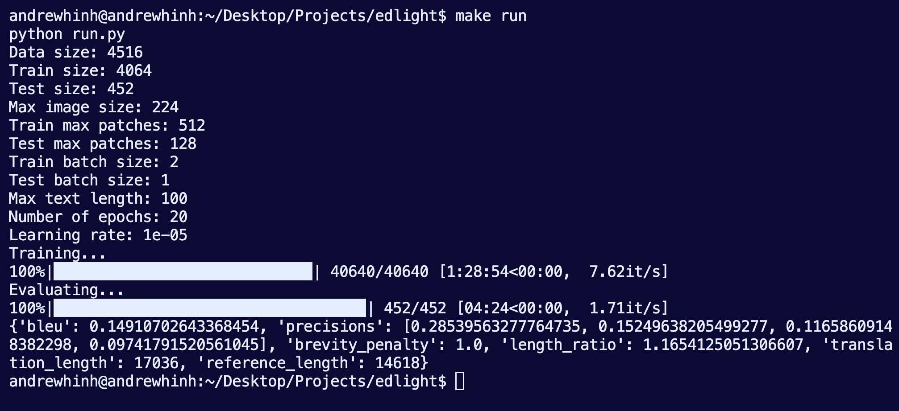

# edlight

Edlight Performance Task



Download the model file [here](https://drive.google.com/drive/folders/1GJA6d1K20M40yx-nFDnBerkaRFEqEXTp?usp=sharing).Then, expand it and place it in the root directory of this project.

## Approach

 I used a Hugging Face implementation of Pix2Struct as my pretrained model. I then separated the image and description dataset into a train-test split of 90-10. Next, I fine-tuned the model on the training set using PyTorch and the Transformers library. Lastly, I evaluated the fine-tuned model on the test set using BLEU to determine the quality of the model.

## Rationale

After looking through Hugging Face, Papers with Code, and this [thread post](https://github.com/salesforce/BLIP/issues/37#issuecomment-1718848499), I discovered that Pix2Struct, specifically the [base model finetuned on TextCaps](https://huggingface.co/google/pix2struct-textcaps-base), was the latest SOTA model for fine-grained image-to-text I could use given the limited RAM I had available. I then chose the 90-10 split because of the limited nature of the data. For training, I decided that using PyTorch would be best for its relative simplicity and flexibility, which would help to explore the best combinations of hyperparameters and data augmentations.

## Potential Shortcomings

Considering the limited nature of the data, there is most likely overfitting that is occuring, implying that caution should be used if this model were ever to be deployed. Additionally, the simplicity of the code implies that this training process would not scale very well to larger datasets, and is in need of support for distributed training. Lastly, given the limited time alloted and equipment I have, it is very likely I did not find the best hyperparameters for training, data augmentations for the images, model among all possible options, etc. However, I believe this model is the best I could have done given the time and cost constraints.

## Potential Improvements

As mentioned above, the best way to improve this model would be to gather more data, support distributed training, and try more models, hyperparameters, data augmentations, etc.

## Setup

Create the conda environment locally:

   ```bash
   make env
   conda activate edlight
   ```

Set up the conda environment:

   ```bash
   make install
   make setup
   ```

## Testing

```bash
make run
```

## Development

To add a new requirement:

   ```bash
   echo "new_package" >> requirements/req.in
   make install
   ```

To bump transitive dependencies:

   ```bash
   make upgrade
   ```

To lint the code manually:

   ```bash
   make lint
   ```
